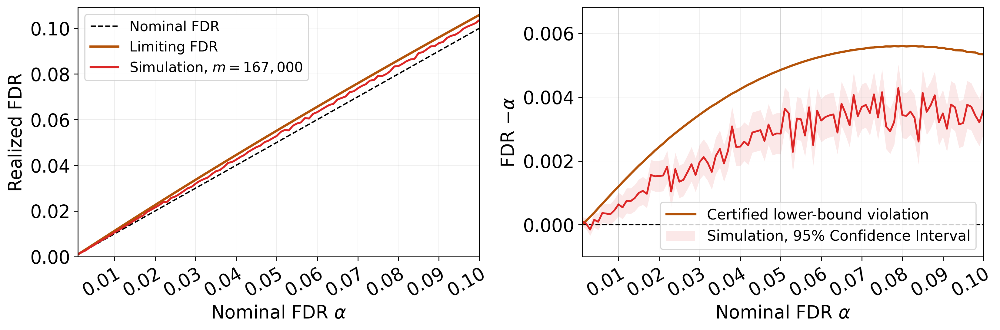

# BH can fail for correlated two-sided Gaussian tests

This repository contains the supporting code and archived computational
results for the PNAS Brief Report draft *The Benjamini--Hochberg Procedure Can
Fail to Control the FDR for Correlated Two-Sided Gaussian Tests* by Edgar
Dobriban.

The main construction is a positive-definite one-factor Gaussian model with
three blocks of sizes `163 N`, `N`, and `3 N`. The repository contains:

- outward-rounded Arb certificates for the main theorem;
- exact conditional count-thinning simulations of ordinary BH;
- the code and data for the manuscript figure;
- a separate finite-dimensional certificate with 85 tests; and
- a six-block example with a larger asymptotic violation.



## Repository layout

```text
experiments/       Executable source code and exact certificate inputs
results/reference/ Immutable outputs used in the PNAS draft
figures/           Manuscript panel and a two-panel diagnostic figure
scripts/           Cross-platform reproduction and integrity tools
tests/             Fast checks of models, archives, and a small MC smoke run
reproduced/        Regenerated outputs; created locally and ignored by Git
```

The reference results are kept separate so that a rerun cannot overwrite the
files used in the draft. Runtime fields and PDF metadata are machine-dependent,
so scientific values are verified separately from repository file hashes.

## Quick start

Python 3.10 or later is required. The repository was validated with Python
3.12.3 and the exact package versions in `requirements.txt`.

```bash
python -m venv .venv
python -m pip install --upgrade pip
python -m pip install -r requirements.txt
python scripts/reproduce.py check
python scripts/reproduce.py figure
```

Activate the environment before installation if desired: on macOS/Linux use
`source .venv/bin/activate`; in PowerShell use
`.venv\Scripts\Activate.ps1`.

`check` verifies repository hashes, validates every manuscript-level archived
claim, compiles the Python sources, and runs the fast unit tests. `figure`
rebuilds both figure versions from the archived CSV files under
`reproduced/figures/`.

GNU Make is optional. For example, `make check`, `make figure`, and
`make certificates` are aliases for the portable Python commands.

## Main model and results

For independent standard normal variables, the central model is

```text
X_i^(0) =        (3/10) Z + (sqrt(91)/10) eps_i,       i = 1,...,163 N
X_j^(1) = 37/20 + (2/11) Z + (3 sqrt(13)/11) eta_j,   j = 1,...,N
X_k^(2) = 59/12 + (20/21) Z + (sqrt(41)/21) xi_k,     k = 1,...,3 N.
```

The first block consists of true nulls. Each coordinate has unit variance,
the covariance matrix is positive definite, and every off-diagonal
correlation is positive.

The theorem-level certificates prove the following strict lower bounds:

| Nominal `alpha` | Certified asymptotic FDR lower bound |
|---:|---:|
| 0.01 | 0.011196841965752766... > 0.0111 |
| 0.05 | 0.054852568515632064... > 0.0548 |
| 0.10 | 0.105337158461421569... > 0.1053 |

The full-grid certificate covers every
`alpha = 0.001, 0.002, ..., 0.100`. All 100 certified excesses are positive.
The SI states the three selected levels as its named main theorem and supplies
the other 97 levels in the subsequent full-grid certificate section.

At `N=1000` (`m=167,000`), the independent 500,000-replication selected-level
simulation gives FDR estimates `0.010610875`, `0.053133673`, and `0.103230111`
at levels `0.01`, `0.05`, and `0.10`. The manuscript figure instead uses the
separate 100,000-replication full-grid run.

## Reproduce individual computations

Every command writes beneath the ignored `reproduced/` directory.

| Computation | Command | Typical archived runtime |
|---|---|---:|
| Three selected Arb certificates | `python scripts/reproduce.py theorem-certificates` | about 20 s total |
| All 100 Arb certificates | `python scripts/reproduce.py certificate-grid` | expensive; runtime not archived |
| Deterministic limiting curve | `python scripts/reproduce.py limiting-curve` | about 30 s |
| Stratified limiting Monte Carlo | `python scripts/reproduce.py limiting-mc` | about 71 s including the curve |
| Full-grid finite-sample Monte Carlo | `python scripts/reproduce.py finite-mc` | about 7 min |
| Selected-level finite-sample Monte Carlo | `python scripts/reproduce.py selected-mc` | runtime not archived |
| Manuscript and diagnostic figures | `python scripts/reproduce.py figure` | a few seconds |
| Finite 85-test certificate | `python scripts/reproduce.py finite-85` | resource intensive |
| Six-block numerical evaluation | `python scripts/reproduce.py six-numerical` | runtime not archived |
| Six-block stratified Monte Carlo | `python scripts/reproduce.py six-mc` | runtime not archived |
| Six-block Arb certificate | `python scripts/reproduce.py six-certificate` | about 15 s |

The full-grid Monte Carlo defaults to 100,000 replications for each of 400
`(N, alpha)` pairs. The selected-level run defaults to 500,000 replications
for each of 12 pairs. The reproduction runner prints the exact underlying
command before execution.

## Manuscript claim-to-file map

| Draft result | Source | Reference output |
|---|---|---|
| Main bounds at `.01`, `.05`, `.10` | `experiments/central_three_block/central_three_block_certificate.py` | `results/reference/central_three_block/certificate_alpha_*.json` |
| Positive bounds at all 100 levels | `central_three_block_certificate_grid.py` | `certified_lower_bound_curve.csv/.json` |
| Figure 1 full-grid simulation | `central_three_block_finite_sample_mc.py` | `finite_sample_fdr_curve.csv/.json` |
| Abstract/SI selected-level values | `central_three_block_selected_levels_mc.py` | `finite_sample_selected_levels.csv/.json` |
| Manuscript figure | `plot_realized_fdr_vs_alpha.py` | `figures/realized_fdr_violation.pdf` |
| Finite `m=85` result | `bh_finite_multiblock_m85_certificate.py` | `results/reference/finite_85_tests/` |
| Six-block larger violation | `experiments/larger_violation_six_block/` | `results/reference/larger_violation_six_block/` |

The deterministic limiting curve and probability-stratified limiting Monte
Carlo are floating-point diagnostics, not parts of the proof. The rigorous
claims are established by the Arb certificate programs.

## Six-block example

The exact six-block model has common block denominator `5e43`; its smallest
fixed block proportion is about `3.05e-28`. It is therefore a mathematically
finite triangular array but cannot be represented by a moderate-dimensional
direct simulation. The rigorous certificate proves

```text
liminf FDR_N(0.05) > 0.0582252019310 > 0.05.
```

The numerical limiting values at levels `.01`, `.05`, and `.10` are
approximately `0.0114245610`, `0.0620459522`, and `0.1176040252`.

## Integrity and reproducibility notes

- Exact model parameters and certificate comparisons use rational inputs and
  outward-rounded Arb balls (`python-flint==0.8.0`).
- The main certificates use 100 decimal digits; the six-block certificate uses
  80; the finite 85-test certificate uses 50.
- Monte Carlo seeds and replication counts are recorded in both source and
  reference JSON files.
- `SHA256SUMS` protects the repository snapshot. Run
  `python scripts/checksums.py` to verify it.
- Regenerated JSON transcripts can differ in elapsed-time fields even when all
  mathematical fields agree.

The manuscript currently points to <https://github.com/dobriban/BH>. If the
repository is published at another URL, update both this file and the PNAS
data-availability statement.

## License

Copyright (c) 2026 Edgar Dobriban. All rights reserved. See `LICENSE`.
